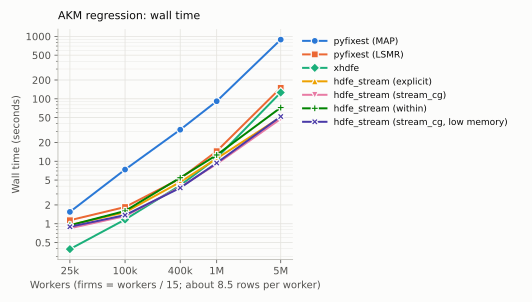
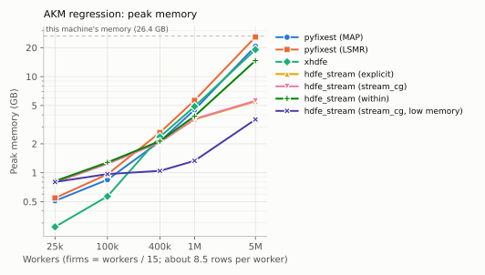
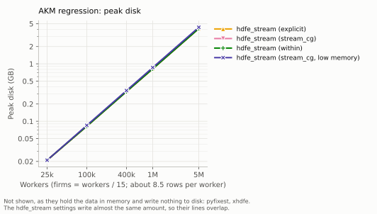

# hdfe-stream

Linear regression with several high-dimensional fixed effects, on data that does
not fit in memory.

```python
from hdfe_stream import feols_stream

fit = feols_stream(
    "log_earn ~ age_squared + age_cubed | worker_id + firm_id + year",
    "data/*.parquet",              # a Parquet path or glob, never fully loaded
    workdir="scratch",             # where intermediates go: disk, not memory
    vcov={"CRV1": "worker_id"},
)
fit.summary()
```

Formulas follow [pyfixest](https://github.com/py-econometrics/pyfixest)/fixest
syntax and are parsed by pyfixest's own parser, so the syntax, the coefficient
names and the results all match. The difference is where the work happens: rows
are streamed off disk in batches and never held as a design matrix.

## When to use this, and when not to

**Use pyfixest.** It is the better tool whenever your data fits in memory:
mature, broader in scope, more inference options, and no scratch directory to
think about. If a `pandas` DataFrame of your data fits comfortably in RAM, stop
reading.

**Use this** when it doesn't. The case it was built for is a matched
employer–employee panel — tens of millions of rows, millions of worker effects,
an AKM variance decomposition — on a machine or a secure enclave where the data
is larger than the memory you are allowed. Concretely, reach for it when:

- the data does not fit in memory, or fits so tightly that nothing else does;
- you have one very high-cardinality dimension (workers, patients, students)
  whose groups each touch only a few levels of the others;
- you want **worker-specific slopes** as well as intercepts (`worker_id[t]`),
  which multiplies the parameter count by the number of slopes;
- you need a hard, predictable memory ceiling — a shared cluster, or a job that
  must not be the one that gets killed.

You are trading memory for disk, and you need scratch space: about five times
the size of your Parquet input while the fit runs, and only the result files
once it finishes. See [benchmarks](#benchmarks) for what that buys.

## How it works, in one paragraph

One fixed-effect dimension — normally the largest — is **streamed**: it
is never represented as a vector in memory. Every other dimension is held as a
vector sized by its number of *levels*, not rows. Rows are read in batches,
hash-partitioned into buckets by the streamed dimension, sorted one bucket at a
time, and reduced to a table of cells (one per combination of fixed-effect
levels). The reduced normal equations for the non-streamed dimensions are then
solved by conjugate gradient, and the streamed effects are recovered group by
group in a final pass that writes residuals and fixed effects straight to
Parquet. So memory scales with firms × years, not with workers × rows, and that
asymmetry is the whole design. Full detail is in
[`hdfe_stream/__init__.py`](hdfe_stream/__init__.py).

## Install

```bash
pip install hdfe-stream[formula]     # formula syntax needs pyfixest
```

`polars`, `numpy`, `numba`, `pyarrow` and `scipy` are required. The extras:

| extra | what it adds |
|---|---|
| `formula` | `feols_stream` formula syntax and pyfixest reporting (pyfixest, formulaic, pandas) |
| `within` | the `solver="within"` backend |
| `amg` | algebraic multigrid preconditioning (`precond="amg"`) for hard geometries |
| `all` | all of the above |
| `test` | the test suite |

Without `formula` you still get `StreamingHDFE`, the lower-level interface that
takes column names or Polars expressions instead of a formula string.

## Features

**Fixed effects.** Any number of dimensions. Interactions with `^`
(`firm_id^year`). Varying slopes on the streamed dimension in fixest syntax
(`worker_id[t]`, `worker_id[t, t2]`). Connected components of the
worker–firm graph are computed and reported, and the degrees-of-freedom
correction counts the fixed-effect parameters that are actually identified
(`fe_dof="exact"`) or follows pyfixest's convention (`fe_dof="pyfixest"`).

**Covariates.** Transformations (`I(age**2)`, `log(x)`), categoricals (`C(x)`,
string columns), interactions (`:`, `*`), event-study terms
(`i(year, treat, ref=2009)`). Terms spanned by the fixed effects are dropped
exactly as pyfixest drops them. Every term compiles to a Polars expression, so
the design is built while the data streams.

**Standard errors.** `iid`, heteroskedasticity-robust (`hetero`/HC1), and CRV1
clustered on any column, any `^` interaction, or several dimensions at once
(multi-way Cameron–Gelbach–Miller, any number of ways). Ask for several at fit
time with `cluster=` and switch between them afterwards with `with_vcov()` —
they are all computed in the one residual pass.

**Estimators.** OLS, weighted least squares (`weights=`, analytic or frequency),
and 2SLS (`y ~ exog | fe | endog ~ instruments`) with a first-stage F.

**Multiple models.** Several outcomes (`y1 + y2 ~ ...`), stepwise covariate sets
(`sw()`, `csw()`) and stepwise fixed-effect sets. Models sharing a fixed-effect
set share one pass over the data and one solve.

**Leave-out variance components.** The Kline–Saggio–Sølvsten bias correction for
the AKM decomposition, via `leave_out_kss` — including the leave-one-out
connected set, Johnson–Lindenstrauss leverages, weights, standard errors with
95% intervals (`se=True`), KSS's weak-identification diagnostic saying whether
those intervals are justified, and the interval that stays valid when they are
not. See [below](#leave-out-variance-components-kss) and
[docs/kss.md](docs/kss.md).

**Output.** Coefficients as a Polars DataFrame (`tidy()`); residuals and
per-row fixed effects as lazy Polars scans, so aggregates like a variance
decomposition run as a streaming pass; estimated effects per dimension via
`fixef()`. `to_pyfixest()` converts a result into a pyfixest model for
`pf.etable`, `pf.summary`, `pf.coefplot` and `pf.iplot`, and `hdfe_stream.etable`
mixes streaming and in-memory models in one table.

**Operations.** Progress, warnings and summaries to a `logging` logger as they
happen. Each fit works in its own run directory; intermediates are deleted as
soon as they are no longer needed, everything is removed if the fit fails, and
`hdfe_stream.cleanup()` sweeps up after killed jobs.

## Benchmarks

A standard three-way AKM specification,
`log_earn ~ age_squared + age_cubed | worker_id + firm_id + year`, clustered by
worker, on the simulated panel that ships with the library. It is compared with
[pyfixest](https://github.com/py-econometrics/pyfixest), under both of its
demeaners, and with [xhdfe](https://github.com/reisportela/xhdfe-xfe), on its
CPU backend. Sizes run from 25,000 to 5,000,000 workers, with firms = workers /
15 at every size and about 8.5 rows per worker, so the largest panel has 42.5
million rows. Every configuration agrees with every other on the coefficients
to within 4e-10, so these are measurements of equally good answers. Reproduce
with:

```bash
pip install -e ".[benchmark]"      # xhdfe installs separately: see benchmarks/README.md
python benchmarks/akm_benchmark.py
python benchmarks/plot_benchmarks.py
```

The numbers behind the figures are in
[benchmarks/results/akm.csv](benchmarks/results/akm.csv), and
[benchmarks/README.md](benchmarks/README.md) says how each is measured. In
brief: wall time includes reading the data, because pyfixest and xhdfe need it in
memory before they can start and hdfe_stream reads it itself — that difference is
the comparison, not an artifact. Peak memory is `VmHWM` for the whole process,
including about 0.5 GB of imports. Each configuration runs in its own process.

<picture>
  <source media="(prefers-color-scheme: dark)" srcset="docs/figures/akm_time.dark.svg">
  
</picture>

<picture>
  <source media="(prefers-color-scheme: dark)" srcset="docs/figures/akm_memory.dark.svg">
  
</picture>

<picture>
  <source media="(prefers-color-scheme: dark)" srcset="docs/figures/akm_disk.dark.svg">
  
</picture>

At 5 million workers:

| configuration | wall time | peak memory | peak disk |
|---|---:|---:|---:|
| pyfixest (MAP, its default) | 888 s | 20.7 GB | — |
| pyfixest (LSMR) | 150 s | 25.8 GB | — |
| xhdfe | 126 s | 19.1 GB | — |
| hdfe_stream (`stream_cg`) | 48 s | 5.6 GB | 3.9 GB |
| **hdfe_stream (`stream_cg`, low memory)** | **52 s** | **3.6 GB** | 4.0 GB |

### Reading the figures

**Memory is the point.** At 5 million workers the in-memory libraries peak at
19–26 GB: pyfixest's LSMR run needed almost all of this machine's 26 GB.
hdfe_stream peaks at 5.6 GB with its defaults and 3.6 GB with the batch and
bucket sizes turned down ("low memory": `rows_per_bucket=250_000`,
`batch_rows=200_000`), for about 10% more time and the same answer. What it
spends instead is disk: about 90 bytes per row, 4 GB at 42.5 million rows, freed
when the fit finishes. The in-memory libraries' peak grows in proportion to the
data. hdfe_stream's low-memory setting grows far more slowly: 0.8 GB at 25,000
workers, 1.3 GB at a million, 3.6 GB at five million.

**It is not slower for it.** From about 400,000 workers up, hdfe_stream is the
fastest configuration measured. At 5 million workers it takes 48 s against
xhdfe's 126 s and pyfixest's 150 s (LSMR) or 888 s (MAP). With AKM panel data,
reducing rows to worker-firm cells before solving more than pays for the disk
traffic. The simulated panel has about 8.5 rows per worker and one cell per
row, which suits this approach; a specification where the cell table is no
smaller than the data, and the fixed effects are less local, may do worse.

**Below about 400,000 workers, the in-memory libraries use less memory.**
Running any hdfe_stream fit costs about 0.8 GB, most of it importing polars,
numba and scipy and starting Polars' streaming engine and numba's thread pools.
On small data that floor dominates: at 25,000 workers xhdfe peaks at 0.27 GB and
pyfixest at about 0.5 GB. This is the concrete version of "use pyfixest (or
xhdfe) if your data fits".

**The default pyfixest demeaner is not the one to compare against.**
`MapDemeaner` (alternating projections) is about 6x slower than `LsmrDemeaner`
from 400,000 workers up, since many worker effects are the case alternating
projections struggles with. If you are comparing, compare against LSMR.

**hdfe_stream's `within` solver** uses more memory at scale: 14.7 GB at 5
million workers, where `stream_cg` and `explicit` stay near 5.5 GB. Prefer
those when memory is the constraint.

### Trading memory for time

Same data, same solver, same answer — only how much is in flight at once:

```bash
python benchmarks/akm_benchmark.py --memory-sweep 1000000
```

**8,500,353 rows, 1,000,000 worker effects**

| `rows_per_bucket` | `batch_rows` | wall time | peak memory | peak disk |
|---:|---:|---:|---:|---:|
| 20,000,000 (default) | 2,000,000 | 7.1 s | 3,861 MB | 779 MB |
| 1,000,000 | 500,000 | 7.4 s | 1,560 MB | 781 MB |
| 250,000 | 200,000 | 7.8 s | 1,343 MB | 795 MB |
| 100,000 | 100,000 | 9.3 s | 1,280 MB | 789 MB |

Most of the saving comes from the first step down. The defaults are tuned for a
machine with room to spare; if memory is the binding constraint, set
`rows_per_bucket` to something near what you can afford and leave the rest
alone. `rhs_block` bounds the other big array (levels × variables), and
`max_s_gb` caps the explicit reduced matrix, above which `solver="auto"` falls
back to `stream_cg` by itself.

Leave-out estimation has a memory knob of its own, `scratch_mb`; see
[docs/kss.md](docs/kss.md#performance).

Measured on an Intel Core Ultra 7 258V, 8 cores, 26 GB RAM, Linux (WSL2);
Python 3.13.5, polars 1.44.2, numpy 2.5.3, numba 0.67.0, scipy 1.18.1,
pyfixest 0.60.0, xhdfe 2.28.0 (CPU backend). The exact versions are in
[benchmarks/results/machine.json](benchmarks/results/machine.json). Numba
kernels are compiled on first use and cached to disk; the benchmark runs a
warm-up fit so compilation is not charged to any configuration.

## Choosing a solver

| `solver` | what it does | when |
|---|---|---|
| `"auto"` (default) | `explicit`, falling back to `stream_cg` if the reduced matrix would exceed `max_s_gb` | leave it alone |
| `"explicit"` | builds the reduced matrix once and solves it in memory | fastest when it fits; its size depends on how levels co-occur, not on rows |
| `"stream_cg"` | applies the reduced matrix by streaming the cell table each iteration | when the reduced matrix is the thing that does not fit |
| `"within"` | hands the reduced system to `within-py` | an alternative; no varying-slopes support |

The streamed dimension is chosen for you: an explicit `stream=` if given, else
the dimension carrying varying slopes, else the highest approximate cardinality.
`result.diagnostics["stream"]` says which and why.

## Examples

Runnable, on simulated data, no setup — see [examples/](examples/):

| | |
|---|---|
| [`quickstart.py`](examples/quickstart.py) | fit a model and read the results |
| [`akm_variance.py`](examples/akm_variance.py) | the variance decomposition, in a streaming pass |
| [`formulas.py`](examples/formulas.py) | the formula syntax, end to end |
| [`weights_and_iv.py`](examples/weights_and_iv.py) | weights and 2SLS |
| [`varying_slopes.py`](examples/varying_slopes.py) | worker-specific trends, and the low-level interface |
| [`out_of_core.py`](examples/out_of_core.py) | memory, disk, solvers, logging |
| [`reporting.py`](examples/reporting.py) | tables and plots via pyfixest |
| [`leave_out_kss.py`](examples/leave_out_kss.py) | the KSS bias correction, checked against the effects the data was built from |

## Simulated data

`hdfe_stream.simulate` ships with the package, so you can try the library, or
check your own code, against data whose answer you know:

```python
from hdfe_stream.simulate import simulate_akm

simulate_akm(n_workers=1_000_000).write_parquet("sim.parquet")
```

`simulate_akm` draws worker and firm effects explicitly and positively assorted,
with enough mobility to connect the firms into one component. `simulate_rich`
adds categoricals, non-fixed-effect cluster variables, weights, an IV block and
missing values; `simulate_trends` adds worker-specific time trends. All are
deterministic given a `seed`.

## Leave-out variance components (KSS)

The plug-in AKM decomposition is biased: worker and firm effects are estimated
with error, which inflates their variances and attenuates their covariance.
`leave_out_kss` applies the bias correction of
[Kline, Saggio and Sølvsten (2020)](https://doi.org/10.3982/ECTA16410), streaming
like the rest of the package:

```python
from hdfe_stream import leave_out_kss

lo = leave_out_kss("log_earn ~ age_squared | worker_id + firm_id",
                   "data/*.parquet", workdir="scratch", se=True)
print(lo.summary())
```

It follows Saggio's reference implementation,
[LeaveOutTwoWay](https://github.com/rsaggio87/LeaveOutTwoWay). It prunes to the
leave-one-out connected set, leaves out a worker–firm match by default, and
approximates leverages by random projection. It supports weights, standard
errors, and KSS's weak-identification diagnostic and q = 1 interval.

**[docs/kss.md](docs/kss.md)** covers the options, the standard errors and their
measured coverage, weak identification, validation, reproducibility, and
[performance against xhdfe](docs/kss.md#performance): at 5 million workers,
5.3 GB of memory against xhdfe's 20 GB, with standard errors in 46 minutes
where xhdfe's did not finish in three hours.
**[docs/kss_methodological_differences.md](docs/kss_methodological_differences.md)**
lists every way this implementation differs from LeaveOutTwoWay,
VarianceComponentsHDFE.jl, xhdfe and pytwoway, with the motivation and measured
effect of each.

## Reproducibility

Everything in a fit is deterministic: the same data and the same options give
the same numbers, with no random component anywhere — to floating-point rounding.
Repeated fits normally agree bit for bit, but aggregation runs in parallel, and
once, under heavy CPU load from another process, two identical fits differed in
the last digit. Treat agreement to about 1e-12 as the guarantee, not bitwise
identity.

The exception is leave-out estimation, which uses random projection and random
draws. Its results are reproducible from the seed but not deterministic;
[docs/kss.md](docs/kss.md#reproducibility) says exactly what they depend on and
what to report in a paper.

## Correctness

The test suite checks every feature against pyfixest on simulated data —
coefficients, standard errors under each vcov, residuals, fixed effects, fit
statistics, the sample kept after dropping missing values, and the exact set of
coefficient names and dropped collinear terms. Varying slopes have no pyfixest
equivalent, so they are checked against a brute-force regression with explicit
worker-by-slope dummies; three-way clustering is checked against an
inclusion–exclusion sum built from pyfixest's own score matrix.

```bash
pip install -e ".[test]"
pytest
```

## Limitations

- **Two fixed-effect dimensions minimum.** For one, use pyfixest.
- **Varying slopes only on the streamed dimension**, and only one dimension may
  carry them.
- **CRV1 only** for clustered errors: no CRV3, no wild bootstrap, no jackknife.
- **A converted result cannot recompute its own vcov**, because it holds no
  data. Ask for what you need at fit time via `cluster=`.
- **Formula support pins a pyfixest range** (`>=0.50,<0.61`), because it uses
  pyfixest's internal formula modules. `StreamingHDFE` has no such dependency.
- **Needs scratch disk**, roughly the size of your data during the fit. Leave-out
  estimation adds to that: it memory-maps its row-sized accumulators rather than
  holding them, which is what keeps it inside a bounded memory footprint, at
  about 90 bytes per row of scratch while it runs.
- **Leave-out estimation handles one outcome at a time**, and its standard
  errors omit the split-sample refinement of KSS §4.2 (so they are conservative,
  as their Lemma 5 provides for). Under weak identification it supplies the
  q = 1 interval, not KSS's q > 1 generalization. Leaving out a match, as it
  does by default, var(alpha) has no standard error and the covariance no q = 1
  interval. See [docs/kss.md](docs/kss.md#what-it-does-not-do-yet).
