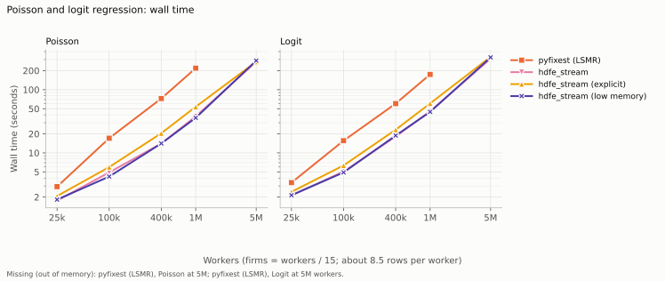
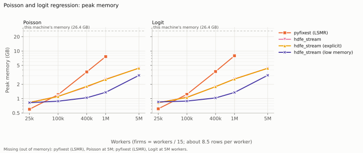
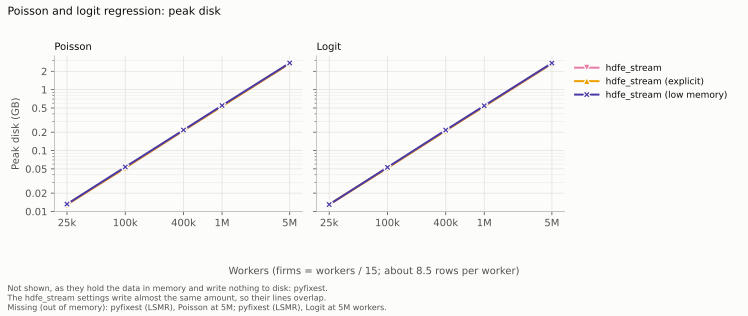
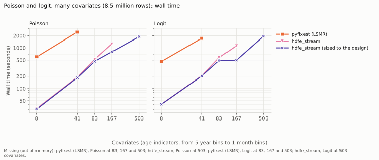
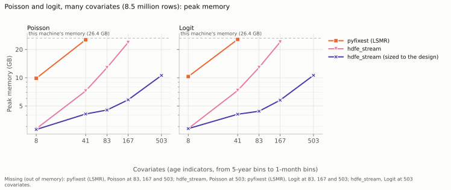
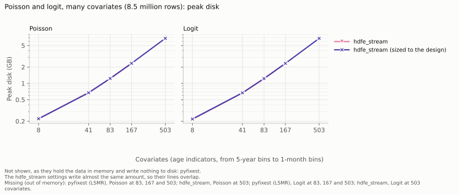

# Poisson, logit and probit

`fepois_stream` and `feglm_stream` fit generalized linear models with
high-dimensional fixed effects on data that does not fit in memory, with the
same formula syntax, inputs and results as `feols_stream`.

```python
from hdfe_stream import fepois_stream, feglm_stream

pois = fepois_stream("visits ~ x | worker_id + firm_id + year", "data/*.parquet",
                     offset="log_exposure", workdir="scratch")
logit = feglm_stream("promoted ~ x | firm_id + year", "data/*.parquet", "logit",
                     workdir="scratch", vcov={"CRV1": "firm_id"})
```

The estimates, standard errors, deviance and log-likelihood match pyfixest's
`fepois` and `feglm` to about 1e-12 on the test panels, with none, one, two
and three fixed effects, interacted fixed effects, every vcov, weights and
offsets (`tests/test_glm.py`). The exceptions, all deliberate, are listed
under [differences from pyfixest](#differences-from-pyfixest).

## How it works

A GLM is fitted by iteratively reweighted least squares (IRLS): each step is
a weighted linear regression of a *working response* on the covariates and
the fixed effects, with weights that depend on the current fit. That
regression is the one `feols_stream` solves, so the GLM reuses its machinery:

- **Once:** pass 0 reads, filters, partitions and sorts the rows, as for OLS,
  and passes 1 and 1b find the cell structure (which worker–firm cells
  identify the firm effects, the connected components).
- **Each step:** one read of the sorted rows computes every row's linear
  predictor from the current coefficients, then its IRLS weight and working
  response, and sums them per cell; the reduced system for the non-streamed
  effects is solved from those sums, starting from the previous step's
  solution; and the coefficients and effects are updated from the cells.
- **Once more:** a final read writes the residual and fixed-effect files and
  computes the standard errors, as for OLS.

Nothing row-sized is written during the iterations. The linear predictor is
rebuilt from the coefficients on each read, and what is rewritten each step
are the cells' weights and sums (memory-mapped, like OLS's identifying
cells). The disk needed is therefore no more than an OLS fit of the same data
needs.

**Memory.** One difference from OLS: the streamed dimension's effects are
held in memory during the iterations, one float per group for each of the
two or three coefficient sets alive at once (for 5 million workers, about
120 MB). OLS never holds a vector over the streamed dimension.

**Several models.** Each model is its own sequence of IRLS steps: the weights
depend on the model, so models cannot share a solve the way `feols_stream`'s
do. Models of the same outcome share pass 0 (the separation check depends on
the outcome, so each outcome gets its own).

## Options

| option | default | what it does |
|---|---|---|
| `family` | | `feglm_stream` only: `"logit"` or `"probit"` |
| `offset` | none | `fepois_stream` only: a column added to the linear predictor with a coefficient of one |
| `iwls_tol` | `1e-8` | converged when the relative change in deviance, \|dev − dev_old\| / (0.1 + \|dev\|), falls below this |
| `iwls_maxiter` | `25` | the most IRLS steps; a fit that reaches it warns, and `diagnostics["irls"]["converged"]` is False |
| `separation_check` | `True` | drop fixed-effect levels whose effect would be infinite; see below |
| `weights`, `weights_type` | none | analytic or frequency weights, multiplying each row's log-likelihood |

Everything else (`vcov`, `cluster`, `fe_dof`, `solver`, `batch_rows`,
`workdir`, ...) is as in `feols_stream`. `assembly` does not apply.

## Results

The result is the same `HDFEResult` as for OLS, with:

- `family`, `deviance`, `loglik`, and `pseudo_r2` (McFadden's, one minus the
  ratio of the log-likelihood to the constant-only model's);
- `rss`, `r2`, `r2_within` and `rmse` set to nan;
- p-values and confidence intervals from the normal distribution, as in
  pyfixest (`tidy()`, `to_pyfixest()`);
- `diagnostics["irls"]`: the number of steps, whether they converged, the
  deviance after each, and how many step-halvings were needed;
- `diagnostics["separation"]`: how many observations and levels were dropped,
  and in how many rounds;
- residual-file columns `eta` (the linear predictor, including any offset),
  `fitted` (the mean), `resid` (the response residual, y − fitted) and
  `resid_working` (the working residual of the final step), besides the
  outcome, `xb` and each row's fixed effects. The fixed effects are on the
  scale of the linear predictor, and `eta` is `xb` plus the fixed effects plus
  the offset.

The vcov is the one pyfixest computes: that of the final weighted
least-squares step. The bread is the inverse of X̃′WX̃, the scores are the
weighted working residuals times the residualized covariates, and the
small-sample factors are pyfixest's. The iid vcov is the bread alone times
(N − 1) / (N − K), since no dispersion parameter is estimated.

## Separation

A fixed-effect level whose outcome is zero on every row (Poisson), or the same
on every row (logit, probit), has an infinite effect: the likelihood keeps
increasing as the effect grows. Such levels are dropped before anything is
written to disk, along with their rows.

- **Poisson:** one pass over the dimensions finds every such level, since
  dropping rows whose outcome is zero leaves every other level's positive rows
  where they were. This is pyfixest's `"fe"` check.
- **Logit and probit:** dropping a level can leave another with a constant
  outcome. Workers whose only 1s were at a firm where everyone had a 1 are left
  with only 0s once that firm is dropped. The passes repeat until one drops
  nothing, and `diagnostics["separation"]["rounds"]` says how many dropped
  something.

A warning reports how many observations were dropped.
`separation_check=False` turns the check off. The iterations then push those
effects toward infinity, and the fit may not converge.

**Separation by the covariates is not detected.** An outcome that a
combination of covariates predicts perfectly (pyfixest's `"ir"` check, after
Correia, Guimarães and Zylkin) makes some coefficients diverge. The symptom is
a fit that does not converge, or coefficients and standard errors that are
very large.

## Differences from pyfixest

**Logit and probit separation.** pyfixest drops levels whose outcome is all 0,
in one pass, and keeps levels whose outcome is all 1. Their effects then grow
without bound while their rows contribute almost nothing. This package drops
both kinds, repeatedly.

- **Coefficients:** the same, to the tolerance the iterations reach, since those
  rows carry no information about them.
- **N and the fixed-effect count:** differ. The standard errors therefore differ
  by the small-sample factors, and pyfixest reports effects for levels this
  package drops.
- **Tests:** they give pyfixest this package's estimation sample.

**Frequency weights.** Here they mean what they mean in OLS: a row with weight
3 counts as three identical rows. The fit, N and every vcov then equal those of
the data with each row repeated, which is what the tests check.

- **pyfixest's `fepois`** counts N as the number of rows, and scales the
  heteroskedastic meat differently. On the test panel its robust standard
  errors differ from those of the repeated data by 3.6%.
- **pyfixest's `feglm`** takes no weights.

**Weights in logit and probit.** They multiply each row's log-likelihood, as in
`fepois` and fixest. Analytic weights give the same coefficients as frequency
weights with the same values; only N and the small-sample factors differ.

**Convergence.** The stopping rule uses the weighted deviance; pyfixest's
`fepois` uses the unweighted one. pyfixest's `feglm` halves a step that raises
the deviance, and this package does the same for all three families, except
Poisson's first step (its starting point is not a set of coefficients, as in
pyfixest). A step that changes the deviance by less than the tolerance counts
as converged without halving, so rounding at the optimum does not trigger a
search.

At tight tolerances (`iwls_tol=1e-12`) both reach the same optimum to about
1e-14. At the default of 1e-8, where each stops can differ in the last few
digits of the coefficients.

## Not available

- **CRV3.** The cluster jackknife is computed by downdating a least-squares
  fit, which is not the jackknife of a GLM. Use CRV1. (pyfixest's CRV3 for
  `feglm` refits each subsample with `fepois`, so it is not a reference for
  logit or probit either.)
- **IV, varying slopes, leave-out (KSS) variance components.** These are linear
  models only.
- **Incidental parameter bias.** With fixed effects estimated from few
  observations each, such as worker effects in a panel of a few years, logit and
  probit coefficients are biased away from zero. Neither pyfixest nor this
  package corrects for it. `examples/glm.py` shows it: the true coefficient is
  0.3, firm and year effects estimate 0.32, and adding worker effects (about
  eight rows each) gives 0.36.

## Performance

A step costs one read of the sorted rows and one solve of the reduced system.
A fit typically takes about 10 steps, so it costs several times what an OLS
fit of the same data costs: 4 to 7 times, in the benchmarks below.

**Solver.** The reduced matrix S depends on the weights, so the `explicit`
solver has to rebuild it at every step. Streaming the cells instead costs one
pass over them per conjugate-gradient iteration, and each solve starts from the
previous step's solution, so the count falls from step to step: from 19 at the
first step to 6 at the eighth on one 3.4-million-row panel. With
`solver="auto"`, the default, S is therefore built for the first step only, and
`stream_cg` is used after that. From 400,000 to 1,000,000 workers, `explicit`
takes within 12% of the time `auto` takes; at 5,000,000, it takes 27 to 30%
less.

With `precond="amg"`, which needs S, it is rebuilt at every step. Setting
`solver=` explicitly applies it to every step.

## Benchmarks

Two benchmarks compare `fepois_stream` and `feglm_stream` with pyfixest's
`fepois` and `feglm`. Both use the simulated AKM panel of the
[OLS benchmarks](../README.md#benchmarks), with two outcomes simulated from the
same worker effects, firm effects and age profile as its `log_earn`: a count
(Poisson) and a binary outcome (logit).

- **Size:** `y ~ age_squared + age_cubed | worker_id + firm_id + year`, from
  25,000 to 5,000,000 workers (212,000 to 42.5 million rows), with firms =
  workers / 15.
- **Covariates:** `y ~ i(age_bin) | worker_id + firm_id` on the
  1,000,000-worker panel (8.5 million rows), with age bins from five years wide
  (8 indicators) to one month wide (503).

Both cluster by worker. pyfixest runs with its LSMR demeaner. Its default, MAP,
stops with "Demeaning failed after 10000 iterations" on these panels at every
size tried, from 25,000 workers up, for both models. xhdfe fits linear models
only.

hdfe_stream runs:

- **Size:** at its defaults, with `solver="explicit"`, and with the OLS
  benchmark's low-memory setting (`rows_per_bucket=250_000`,
  `batch_rows=200_000`).
- **Covariates:** at its defaults, and "sized to the design", with bucket,
  batch and row-group sizes scaled down as the design widens (the rule is in
  `benchmarks/covariates_benchmark.py`).

Each configuration runs in its own process, and wall time includes reading the
data. [benchmarks/README.md](../benchmarks/README.md) describes how peak memory
and disk are measured. The numbers are in
[glm.csv](../benchmarks/results/glm.csv) and
[glm_covariates.csv](../benchmarks/results/glm_covariates.csv); the machine has
8 logical CPUs and 26 GB of memory. To reproduce:

```bash
python benchmarks/glm_benchmark.py
python benchmarks/glm_covariates_benchmark.py
python benchmarks/plot_benchmarks.py
```

Wherever both libraries finished, the coefficients agree to within 1e-7, the
tolerance the iterations reach, except for Poisson at 41 covariates, where they
agree to within 3e-6. For logit, pyfixest keeps workers whose
outcome is 1 in every year, which this package drops (see
[differences from pyfixest](#differences-from-pyfixest)), so its N is larger:
8,404,384 against 8,283,651 at 1,000,000 workers.

### Size

<picture>
  <source media="(prefers-color-scheme: dark)" srcset="figures/glm_time.dark.svg">
  
</picture>

<picture>
  <source media="(prefers-color-scheme: dark)" srcset="figures/glm_memory.dark.svg">
  
</picture>

<picture>
  <source media="(prefers-color-scheme: dark)" srcset="figures/glm_disk.dark.svg">
  
</picture>

Wall time and peak memory, hdfe_stream at its defaults:

| workers | rows | Poisson: `fepois_stream` | Poisson: pyfixest | logit: `feglm_stream` | logit: pyfixest |
|---:|---:|---:|---:|---:|---:|
| 25,000 | 212,000 | 1.8 s, 0.8 GB | 3.2 s, 0.6 GB | 2.3 s, 0.8 GB | 3.0 s, 0.6 GB |
| 100,000 | 850,000 | 4.7 s, 1.1 GB | 15 s, 1.2 GB | 5.2 s, 1.1 GB | 13 s, 1.2 GB |
| 400,000 | 3.4 million | 15 s, 1.8 GB | 68 s, 3.6 GB | 16 s, 1.8 GB | 60 s, 3.7 GB |
| 1,000,000 | 8.5 million | 34 s, 2.6 GB | 203 s, 7.6 GB | 42 s, 2.6 GB | 171 s, 8.0 GB |
| 5,000,000 | 42.5 million | 287 s, 4.4 GB | out of memory | 351 s, 4.4 GB | out of memory |

- **Time.** From 100,000 workers up, hdfe_stream is 2.4 to 6 times faster.
- **Memory.** At 5,000,000 workers pyfixest ran out of this machine's 26 GB,
  for both models. hdfe_stream peaked at 4.4 GB, or 3.1 GB with the low-memory
  setting, in about the same time. At 25,000 workers pyfixest uses less, as
  with OLS: an hdfe_stream process costs about 0.8 GB before it has done
  anything.
- **Disk.** About 67 bytes per row: 2.8 GB at 42.5 million rows, where OLS on
  the same design writes 4.1 GB.
- **Against OLS.** `feols_stream` fits the same design in 9.0 s at 1,000,000
  workers and 52 s at 5,000,000, so a Poisson or logit fit costs 4 to 7 OLS
  fits.

### Covariates

<picture>
  <source media="(prefers-color-scheme: dark)" srcset="figures/glm_covariates_time.dark.svg">
  
</picture>

<picture>
  <source media="(prefers-color-scheme: dark)" srcset="figures/glm_covariates_memory.dark.svg">
  
</picture>

<picture>
  <source media="(prefers-color-scheme: dark)" srcset="figures/glm_covariates_disk.dark.svg">
  
</picture>

Wall time and peak memory, hdfe_stream sized to the design:

| covariates | Poisson: `fepois_stream` | Poisson: pyfixest | logit: `feglm_stream` | logit: pyfixest |
|---:|---:|---:|---:|---:|
| 8 | 36 s, 2.8 GB | 321 s, 9.9 GB | 40 s, 2.9 GB | 266 s, 10.3 GB |
| 41 | 113 s, 4.1 GB | 1,256 s, 25.4 GB | 127 s, 4.1 GB | 905 s, 25.6 GB |
| 83 | 251 s, 4.5 GB | out of memory | 268 s, 4.4 GB | out of memory |
| 167 | 484 s, 5.8 GB | out of memory | 515 s, 5.8 GB | out of memory |
| 503 | 1,957 s, 10.6 GB | out of memory | 2,052 s, 10.6 GB | out of memory |

- **pyfixest** needs about 25.5 GB at 41 covariates, nearly all of this
  machine's 26 GB, and runs out of memory from 83 up.
- **hdfe_stream at its defaults** needs more memory as the design widens than
  when sized to it: 12.8 GB at 83 covariates, 24.0 GB at 167, and more than
  the machine has at 503. Its batches and buckets hold a fixed number of rows
  however wide the rows are. For a wide design, size them as the benchmark
  does, as for OLS.
- **Disk** grows with the width, to 6.8 GB at 503 covariates, a little more
  than OLS writes for the same design (5.5 GB).
- **Against OLS.** At 503 covariates, sized the same way, OLS takes 329 s and
  8.6 GB, and the GLM 1,957 s and 10.6 GB.
