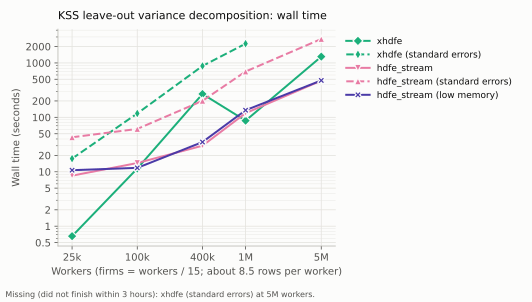
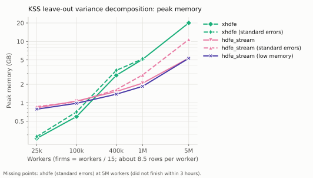
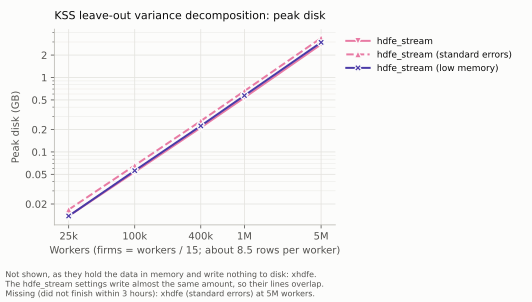

# Leave-out variance components (KSS)

The plug-in AKM decomposition is biased. Worker and firm effects are each
estimated from a handful of observations, and that estimation error inflates
their measured variance and attenuates the covariance between them — so the
plug-in numbers overstate heterogeneity and understate sorting. The shorter the
panel, the worse it gets: this is the limited-mobility bias of Andrews et al.
(2008).

[Kline, Saggio and Sølvsten (2020)](https://doi.org/10.3982/ECTA16410) remove it
without assuming homoskedasticity, and `leave_out_kss` implements that. It is an
implementation of their standard cases, following Saggio's reference code,
[LeaveOutTwoWay](https://github.com/rsaggio87/LeaveOutTwoWay). Every departure
from it, and from VarianceComponentsHDFE.jl, xhdfe and pytwoway, is listed with
its motivation and measured effect in
[kss_methodological_differences.md](kss_methodological_differences.md).

```python
from hdfe_stream import leave_out_kss

lo = leave_out_kss("log_earn ~ age_squared | worker_id + firm_id",
                   "data/*.parquet", workdir="scratch", n_draws=250)
lo.summary()
lo.tidy()        # component / plug_in / bias / leave_out, as a Polars frame
```

```
component                plug-in        bias   leave-out
--------------------------------------------------------
var(psi)                0.063973    0.002997    0.060976
var(alpha)              0.178427    0.012475    0.165952
cov(psi, alpha)         0.027097   -0.002642    0.029739
```

One call does three things, in an order that is not negotiable:

1. **Prunes to the leave-one-out connected set.** The correction needs every
   effect to stay estimable when any one match is dropped, which fails at
   workers who are the only link between two parts of the worker–firm network.
   They are removed, and the pass repeated until none is left, since removing
   one can make another; workers observed only once are dropped as well. This
   is what LeaveOutTwoWay and xhdfe do, and it matches xhdfe row for row.
2. **Fits on what survives.**
3. **Approximates each match's leverage** by random projection, and from those
   computes the bias.

**Pruning changes the estimation sample, which is why it comes first.** On the
simulated panel it costs 0.1% of rows; in KSS's own application it removes about
half the firms. A decomposition computed from a fit made *before* pruning would
be describing a different model, so there is no "fit then decompose it" path
that skips this. `prune=False` checks instead of pruning, and fails if the panel
is not already connected — for callers who pruned upstream.

`leave_one_out_connected(data)` is available on its own if you want the pruned
panel for something else.

## What is left out: a match, or an observation

By default the correction leaves out a whole **worker–firm match** — every year
of a spell at once — as LeaveOutTwoWay, VarianceComponentsHDFE.jl and xhdfe all
do. Earnings errors are correlated within a spell; leaving out one year treats
the others as independent of it, and the leave-out variance estimate is then
biased. In a Monte Carlo with half the error variance a spell-level shock, the
observation-level estimates of var(psi) and the covariance were off by 6% and
15% (t = 7 and 12), and the match-level ones by nothing measurable.

It is computed the reference's way: partial out everything but the two effects,
collapse to one row per match weighted by its length, and run the correction on
that weighted regression — whose leverages are the matches'. The components are
still person-year moments, divided by person-years − 1.

```python
lo = leave_out_kss(fml, data, workdir="scratch")                            # a match
lo = leave_out_kss(fml, data, workdir="scratch", leave_out="observation")   # one year
```

What differs between them:

| | `leave_out="match"` (default) | `leave_out="observation"` |
|---|---|---|
| robust to errors correlated within a spell | yes | no |
| a stayer's variance | its own years' residuals, averaged over the spell (LeaveOutTwoWay's `sigma_for_stayers`) | its own leave-out estimate, like any other row (`stayers=` to change) |
| standard errors (`se=True`) | var(psi) and cov, following `leave_out_COMPLETE`'s beta match-level option ([below](#standard-errors-when-leaving-out-a-match)) | all three components |
| q = 1 interval under weak identification | var(psi) | all three components |
| fit needs `keep_intermediates=True` | no | yes |

Match-level standard errors follow LeaveOutTwoWay's `leave_out_COMPLETE`, whose
match-level option is marked beta there. The differences are listed
[below](#standard-errors-when-leaving-out-a-match). One caution that
no leave-out scheme removes: when a spell-level shock is present, var(alpha) is
biased at both levels, because a stayer's worker effect cannot be told apart
from its one spell's shock.

**`centering=`**, at match level only. The default, `centering="reference"`,
follows LeaveOutTwoWay: it centers the outcome after transforming by `√w`,
`√w·ȳ − mean(√w·ȳ)`. `centering="weighted"` is a **deviation from the
reference**: it centers `ȳ` at its weighted mean first, `√w·(ȳ − ȳ_w)`.

- *When it matters.* The two give the same result when spells are all the same
  length, and nearly the same when the outcome's mean is near zero. Both are
  unbiased.
- *Benefit.* Otherwise the reference's centering carries the outcome's *level*
  into `σ̂²`, and so depends on where the outcome is located. With log earnings
  (mean about 10), its estimates were 1.7–3 times as variable across simulated
  samples, and 5–70 times as variable across seeds at a fixed number of draws.
- *Cost.* The weighted centering does not reproduce LeaveOutTwoWay's or xhdfe's
  numbers on the same data. Keep the default when replicating their results.

See [kss_methodological_differences.md](kss_methodological_differences.md) §3.4.

## If you want the regression too

`leave_out_kss` is a wrapper over three steps you can take yourself. Leaving
out a match reads only the fit's residual file, which every fit keeps; leaving
out an observation reads the sorted rows and cell tables a fit otherwise deletes
when it finishes, so that needs `keep_intermediates=True`:

```python
panel = leave_one_out_connected("data/*.parquet")
fit   = feols_stream(fml, panel.data, workdir="scratch")
lo    = fit.leave_out_kss(n_draws=250)
```

The two give identical numbers.

## Choosing `n_draws`

The leverages are approximated, so the result carries Monte Carlo noise.
Accuracy does **not** have to grow with the data — KSS report the error falling
with sample size at fixed draws — so this is a budget, not a function of `n`.
They operate at 250–500 on panels with millions of effects, and so should you.

The way to know it is enough is to vary the seed and look at the spread.
Measured across five seeds on the example panel (8,000 workers, 67,913
person-years, 13,404 matches), as the standard deviation of each estimate:

| setting | 250 draws, % of the estimate | 1,000 draws | at 250 draws, relative to the standard error |
|---|---|---|---|
| leaving out a match (default) | 0.07–0.53% | 0.06–0.27% | 9–12% |
| leaving out a match, `centering="weighted"` | 0.06–0.21% | 0.02–0.10% | about 10% |
| leaving out an observation | 0.01–0.06% | 0.00–0.08% | 2.5–3.5% |

Leaving out a match is the noisier of the two: fewer rows carry the leverages,
and with the default centering each row's σ̂² carries the outcome's level (see
[kss_methodological_differences.md](kss_methodological_differences.md) §3.4). Even
there, the approximation's noise at 250 draws is about a tenth of the standard
error, so it adds well under 1% to the total uncertainty. Check it on your own
panel rather than relying on these numbers.
See [Reproducibility](#reproducibility) for what to report in a paper.

## Weights

`weights=` works, and then the estimand is the **weighted** variance
decomposition. Everything follows from that one choice:

- leverages are those of the square-root-weight hat matrix,
  `P_ii = w_i x_i' (A'WA)^- x_i` — of the two hat matrices a weighted fit
  admits, only that one is symmetric and idempotent, so only that one gives
  leverages;
- the plug-in variances and covariance are weighted, because the bias term is a
  bias *for those*;
- `sigma2` carries a factor of `w`, since the sandwich
  `S^- A'W Ω W A S^-` has two of them and the trace supplies one itself.

Unweighted, every one of those reduces to the plain KSS expression, and the
unweighted results are unchanged to floating point. The weighted path is
validated the same way the rest is: Monte Carlo against known effects in the
dense prototype, then streaming against the prototype.

## Standard errors

Pass `se=True`:

```python
lo = leave_out_kss(fml, "data/*.parquet", workdir="scratch", se=True)
print(lo.summary())          # adds an se column and a 95% interval
lo.se.se["var(psi)"]         # and the pieces it came from
```

The estimator is a quadratic form `ỹ'Cỹ` whose kernel has a **zero diagonal**:

```
C = B − ½(diag(b)·M + M·diag(b)),   b_i = B_ii/(1 − P_ii)
```

`C_ii = B_ii − M_ii·(B_ii/M_ii) = 0` identically. That single fact gives
unbiasedness in one line, makes the variance

```
V[θ̂] = 4 Σ_i σ²_i (Cμ)_i² + 2 tr(CΩCΩ)
```

with **no appeal to normality** (the third- and fourth-moment terms all carry a
factor of `C_ii`), and gives an exact test of the implementation: `ỹ'Cỹ` must
reproduce `plug-in − bias` to floating point, which it does to 1e-14.

The estimator substitutes `σ̃²` for `σ²` and `ỹ` for `μ`. Its first term
overshoots by exactly `4 tr(CΩCΩ)`, so subtracting `2 tr` leaves it unbiased —
and means the first term **alone is conservative**. That one is reported too, as
`se_conservative`, and `se_trace=False` computes only it, saving about three
solves per draw. Leaving out an observation, the trace term was 1–9% of the
first, so it moved the standard error by under 5%. Leaving out a match there are
fewer rows and it can be much larger: about half the first term for the
covariance on a simulated panel of 376 matches with the weighted centering. So
`se_trace=False` is a real loss of precision there, though still conservative.

**Measured coverage leaving out an observation**, design and true effects held
fixed and errors redrawn (800 replications, so about ±0.8 points), with fourfold
heteroskedasticity. Coverage when leaving out a match is in the
[next section](#standard-errors-when-leaving-out-a-match).

| n | var(psi) | var(alpha) | cov |
|---|---|---|---|
| 1,540 | 94.9% | 95.2% | 93.4% |
| 5,120 | 95.0% | 95.0% | 94.6% |

and `√V̂` matches the true sampling standard deviation within 3%. The one gap
from 95%, the covariance on the smaller panel, has a specific cause: KSS's
Theorem 2 needs `λ²₁/Σλ² = o(1)` for the eigenvalues of `Ã = S^-½QS^-½`, and on
panels this small that ratio is 0.09–0.30 rather than small; ranking the three
components by it reproduces the coverage ranking. Panels from roughly 800
workers up satisfy it, and the output reports it — see
[below](#is-the-normal-interval-justified).

**One deviation from the paper, which the reference implementation also makes.**
KSS's `σ̃²` is cross-fit from two predictions built on disjoint information — in
a two-way model, two *edge-disjoint paths* through the worker–firm network, found
by Dijkstra — and their `V̂` then classifies every `(i, ℓ)` pair by the sparsity
pattern of those paths. A per-observation graph search and an O(n²) pair loop are
both out of reach for streaming, and neither is in Saggio's MATLAB reference
either: it smooths the ordinary leave-out `σ̂²` against `(P_ii, B_ii)` and
estimates the trace by simulation, which is what happens here. Their Lemma 5
covers this case — the bias of `V̂` is non-negative, so inference stays valid and
becomes conservative rather than anticonservative.

That smoothing is **required, not cosmetic**: with raw `σ̂²` the estimated
`tr(CΩ̂CΩ̂)` comes out *negative* (it is `Σ C²_iℓ σ²_i σ²_ℓ`, which cannot be),
because raw `σ̂²_i` is often negative — and coverage falls to 92%. See
[prototypes/SE_NOTES.md](../prototypes/SE_NOTES.md) for the derivation, the
reference comparison and the full Monte Carlo.

Weights need nothing extra when leaving out an observation: inference runs in
the same square-root-weight metric the point estimate uses. Leaving out a match,
the default variance source has no weights in the reference, so a weighted fit
needs `se_variance="match"` (next section).

## Standard errors when leaving out a match

**Reference implementation:** LeaveOutTwoWay's older entry point,
`leave_out_COMPLETE`, with `leave_out_level='matches'`. That option is not its
default, and its own documentation calls it "currently in beta mode and needs
further testing". It is the only implementation there is: Saggio's current
`leave_out_KSS` reports no standard errors, and xhdfe's are a port of this path.
This package follows it except where listed below:
- the same kernel;
- the same conventions for stayers, whose single match has leverage one;
- no standard error for var(alpha);
- the same per-person-year error variance.

The reference's person-year block kernel turns out to be the collapsed
regression's own zero-diagonal kernel, so the same machinery serves both levels.
The prototype checks this to 10⁻¹³ and streaming to 10⁻¹⁰. A literal port of
xhdfe's code in the prototype reproduces xhdfe's numbers, and is kept as a
regression test.

Where this package differs from the reference:

- **The outcome is centered**, as the point estimate is. The reference uses the
  raw outcome, so on log earnings the variance estimate is dominated by the
  outcome's level and comes out negative. xhdfe then reports a standard error of
  **zero**, which it did in 84–99.6% of samples in the Monte Carlo below.
- **σ̃ uses the package's smoother.** The reference's fixed 1,000 × 1,000 grid
  leaves about one person-year per cell on panels below a million rows.
- **No user weights** with the default variance source, which has none in the
  reference.
- **No q = 1 interval for the covariance** (var(psi) has one).

`se_variance=` chooses how each match's error variance is estimated:

- `"person_year"` (default) is the reference's, and the only one it has. It
  pools the variation within the spell, which is efficient when errors are
  independent within a spell. It estimates only the diagonal of the spell's error
  covariance, so it assumes that independence.
- `"match"` goes beyond the reference. It uses the collapsed leave-match-out
  estimate, which stays right when errors are correlated within a spell, and it
  supports weights. It is noisier.

Coverage of the 95% interval, var(psi) / cov (500 replications per cell):

| panel | errors | `"person_year"` (default) | `"match"` | xhdfe, outcome demeaned first |
|---|---|---|---|---|
| 837 matches | independent | 95.8 / 93.6 | 96.0 / 91.8 | 92.0 / 89.2 |
| 837 matches | half the variance a spell shock | **86.2 / 82.0** | 95.0 / 92.2 | 77.4 / 68.6 |
| 406 matches | independent | 94.8 / 95.0 | 92.8 / 87.0 | 89.8 / 89.8 |
| 406 matches | half the variance a spell shock | **86.0 / 83.6** | 95.4 / 89.0 | 71.2 / 66.2 |

With independent errors the default is as good or better. If errors may be
correlated within a spell, use `"match"`: the default then understates the
standard error by 25–30%, and more data does not fix it. Details in
[kss_methodological_differences.md](kss_methodological_differences.md) §5.7.

## Is the normal interval justified?

The interval above rests on KSS's Theorem 2 condition (ii): no single
eigen-direction may dominate the estimator's variance, `λ²₁/Σλ² = o(1)` for the
eigenvalues of `Ã = S^-½QS^-½`. A bottleneck in the mobility network — two
groups of firms joined by a handful of movers — breaks it: one linear
combination of the effects is then estimated badly, the estimator is no longer
approximately normal, and the interval undercovers.

With `se=True` the output says which case you are in, by KSS's own rule (§6.2):
`q` counts the leading eigenvalues with `λ²/Σλ² ≥ 1/10`, and only `q = 0`
justifies the normal interval. The diagnostic is the same at either leave-out
level. The outputs below are from `leave_out="observation"`, where all three
components get standard errors:

```
weak-identification diagnostic (KSS threshold 0.1 on lambda^2 / sum lambda^2)
component          lam1^2/sum lam2^2/sum lam3^2/sum    q        F  normal interval
----------------------------------------------------------------------------------
var(psi)               0.9826     0.0017     0.0017    1     6.26  NOT justified
var(alpha)             0.9022     0.0016     0.0015    1     0.50  NOT justified
cov(psi, alpha)        0.9919     0.0009     0.0009    1     2.59  NOT justified
```

That is two blocks of eight firms joined by six movers
(`simulate_bottleneck(n_bridge=6)`); a well-connected
3,000-worker panel reads 0.06 / 0.05 / 0.07, all `q = 0`. When `q ≥ 1` the
affected intervals are starred and a warning is raised; the point estimate is
unbiased either way. `F` is the first-stage F of the leading direction — how well
its nuisance parameter is identified. Pass `diagnose=False` to skip it, or
`diagnose=True` to run it without standard errors.

It costs little next to the standard errors — 9 s on a 452 s run over 1.3M rows
at the default budgets, about 2%, leaving out an observation — and it streams: the leading
eigenvalues come from Lanczos in the `S⁻` inner product (one solve per step, no
extra passes over the rows), and `Σλ²` from Hutchinson deflated by the Ritz
vectors Lanczos already found, so the Monte Carlo only has to estimate the small
remainder. That deflation is what makes the estimate accurate exactly where it
matters — on a bottleneck of two movers the plain estimator was off by up to 160%. Draws
stop as soon as no ratio is within two standard errors of 1/10, and a ratio still
that close when the budget runs out is marked `~`.

Every piece is checked against dense `eig(S⁻Q)` and `tr((S⁻Q)²)`: eigenvalues to
1e-13 at convergence, including a panel whose two leading eigenvalues are 2%
apart. See [prototypes/WEAKID_NOTES.md](../prototypes/WEAKID_NOTES.md).

## When it is not: the q = 1 interval

For every component the diagnostic flags, `se=True` also reports KSS's
weak-identification interval (Theorem 3 with Andrews–Mikusheva critical
values), which stays valid there. Leaving out a match it is reported for
var(psi) only (see [below](#what-it-does-not-do-yet)); this output leaves out an
observation:

```
intervals valid under weak identification (KSS Theorem 3, q = 1, 95%)
component              leave-out                    interval   kappa   width vs normal
--------------------------------------------------------------------------------------
var(psi)                0.038995        [0.031393, 0.057348]    0.99             1.24x
var(alpha)              0.146609        [0.140923, 0.157213]    0.65             1.36x
cov(psi, alpha)        -0.000346       [-0.014715, 0.002551]    2.40             1.47x
```

The idea: split the estimate into the badly identified direction and the rest,
`θ̂ = λ₁(b̂₁² − V̂[b̂₁]) + θ̂₁`. The pair `(b̂₁, θ̂₁)` is jointly normal even when
`θ̂` is not, so take its confidence ellipse and map it through `λ₁b² + θ₁`. The
image is the interval — which is why it is **not symmetric** about the estimate:
the weak direction enters squared. Mapping a 2-D ellipse would ordinarily need
the χ²(2) critical value; Andrews and Mikusheva show the map's curvature `κ`
lets it come down toward χ²(1), so the interval is no wider than it must be.

How it is computed, and why that is exact rather than approximate:

- Deflating `B` by the leading direction gives `θ̂₁ = ỹ'C₂ỹ` **exactly**, again
  a quadratic form with a zero diagonal, so the covariance of `(b̂₁, θ̂₁)` follows
  from the same algebra as the standard errors, with no normality assumption.
  It streams the same way, reusing the eigenvector the diagnostic already found.
- The critical value has an exact one-dimensional integral form for q = 1, so
  there is no simulated lookup table (the reference ships one; its repository
  carries no license).
- The interval matches Saggio's closed-form quartic to 3e-15 and its own
  definition — extremes over the filled ellipse — to grid resolution.

**Measured coverage leaving out an observation**, with the design and true
effects fixed and errors redrawn (two blocks of eight firms joined by six
movers, λ₁²/Σλ² = 0.90–0.99):

| δ (block gap) | var(psi): normal → **q = 1** | var(alpha) | cov |
|---|---|---|---|
| 0.00 | 89.5% → **95.8%** | 94.2% → **97.0%** | 73.5% → **97.8%** |
| 0.25 | 91.7% → **95.0%** | 92.8% → **97.2%** | 85.3% → **95.8%** |
| 0.50 | 93.5% → **96.5%** | 94.3% → **97.3%** | 91.3% → **97.7%** |
| 1.00 | 93.0% → **95.7%** | 93.3% → **97.2%** | 92.5% → **96.0%** |

(600 replications per cell, so about ±0.9 points. δ shifts the second block's
firm effects, which moves the weak direction's true value away from zero.)
With sixteen bridging movers the design is less weak (0.57–0.94) and the normal
interval recovers to 88–95%, while the q = 1 interval stays at 93.8–97.3%; its
lowest cells are where the weak direction is well identified and even an oracle
using the true covariance only reaches about 95%.

The normal interval undercovers — down to 73.5% — and the q = 1 interval reaches
nominal coverage everywhere, at the cost of a wider interval (24–47% wider on the
panel shown above). With only two bridging movers the weak
direction rests on about eight rows, outside the theorem's conditions; there the
normal interval falls to 50% and the q = 1 interval is conservative, at 97–99.5%.
On such a design the normal standard error can also be undefined, because the
variance estimate comes out non-positive: with `simulate_bottleneck(n_bridge=2)`
and `seed=0` that happens for var(psi) and the covariance. The q = 1 interval is
still reported for them. `simulate_bottleneck` builds these designs if you want
to see it yourself.

`weak_interval=False` skips it; `confidence=` sets the level of both intervals.
It costs roughly one more set of standard-error draws per flagged component and
nothing when none is flagged.

## What it does not do yet

- **var(alpha)'s standard error when leaving out a match,** following the
  reference, and **the covariance's q = 1 interval** there. Stayers load on its
  weak direction, which the collapsed kernel cannot represent. Both are
  available with `leave_out="observation"`.
- **q ≥ 2.** When two or more directions are weak, the q = 1 interval accounts
  for only the leading one and may undercover; the output says so. KSS's q > 1
  interval needs a (q+1)-dimensional quadratic program and the full curvature
  maximization.
- **Several outcomes at once.** Fit them separately.

## How it is checked

The correction is subtle and easy to get quietly wrong, so it is validated three
ways. A dense, exact implementation in [`prototypes/`](../prototypes/) is checked
against **known truth** by Monte Carlo — the simulator draws the worker and firm
effects, so the estimand is known — confirming the plug-in estimator is biased in
the documented direction and the corrected one is not. The streaming version is
then checked against that prototype (agreeing to 3e-5 at 1024 draws), and
independently against [pytwoway](https://github.com/py-econometrics/pytwoway) on
an identical sample (plug-in exact, leave-out within 0.2%). The prototype's
match-level estimator reproduces [xhdfe](https://github.com/reisportela/xhdfe-xfe)
— itself a port of LeaveOutTwoWay — to machine precision at both levels, and
its pruning matches xhdfe's row for row. For match-level standard errors, a
literal port of xhdfe's code reproduces xhdfe's, and the package's own version
is checked against the dense kernel exactly (the quadratic form reproduces the
point estimate to 10⁻¹⁰) and by Monte Carlo coverage.

[`examples/leave_out_kss.py`](../examples/leave_out_kss.py) runs the whole thing
against the effects the data was generated from, so you can watch the bias
appear and be removed.

## Performance

The whole decomposition is compared with
[xhdfe](https://github.com/reisportela/xhdfe-xfe) on its CPU backend. That
means pruning, fitting, partialling out the controls, collapsing to matches,
random-projection leverages and the correction, plus standard errors when
asked. The model is `log_earn ~ age_squared + age_cubed | worker_id + firm_id`,
on the same simulated panels as the regression benchmark (firms = workers /
15). Both libraries leave out a match, follow LeaveOutTwoWay's conventions, and
use 200 random-projection draws. For the standard errors each uses its own
defaults: xhdfe simulates the trace term with 1,000 draws of the quadratic form,
hdfe_stream with 200 Hutchinson draws (see
[kss_methodological_differences.md](kss_methodological_differences.md) §5.2).
At every size the two point estimates agree to within 0.3%, and from 100,000
workers up to within 0.12%, which is random-projection noise. Reproduce with `python benchmarks/kss_benchmark.py`;
the numbers are in [benchmarks/results/kss.csv](../benchmarks/results/kss.csv).

<picture>
  <source media="(prefers-color-scheme: dark)" srcset="figures/kss_time.dark.svg">
  
</picture>

<picture>
  <source media="(prefers-color-scheme: dark)" srcset="figures/kss_memory.dark.svg">
  
</picture>

<picture>
  <source media="(prefers-color-scheme: dark)" srcset="figures/kss_disk.dark.svg">
  
</picture>

At 5 million workers (42.5 million rows):

| configuration | wall time | peak memory | peak disk |
|---|---:|---:|---:|
| xhdfe | 782 s | 20.0 GB | — |
| xhdfe, standard errors | did not finish within 3 hours | | |
| hdfe_stream | 472 s | 4.8 GB | 2.8 GB |
| hdfe_stream, standard errors | 2,917 s | 10.8 GB | 3.4 GB |

**At scale, memory is the difference.** At 5 million workers xhdfe's point
estimate peaks at 20 GB, and hdfe_stream's at 4.8 GB, while writing 2.8 GB to
disk. With standard errors hdfe_stream peaks at 10.8 GB, still about half of
xhdfe's point estimate alone. Both prune to exactly the same sample at every
size, and at 5 million workers their estimates agree to within 0.01%.

**Standard errors are where the time goes.** From 100,000 workers up,
hdfe_stream's are 1.7 to 4.5 times faster than xhdfe's: 475 s against 2,127 s at
a million workers. At 5 million, xhdfe's did not finish in the three hours
allowed and hdfe_stream's took 49 minutes. The two estimate the trace term
differently (§5.2 of the differences catalog); xhdfe's default is 1,000
simulated draws of the full quadratic form.

**Small panels favor xhdfe.** At 25,000 workers its point estimate takes 0.8 s
and 0.27 GB, against hdfe_stream's 9.4 s and 0.9 GB. hdfe_stream pays fixed
costs a small panel cannot amortize: importing its dependencies, and two fits
(the regression and the collapsed match-level one), each with its own passes
over the data.

**xhdfe's 400,000-worker point is its solver routing, not noise.** By default it
factors the firm system directly up to 50,000 firms and iterates above that. At
400,000 workers (26,661 firms) the factorization alone took about 250 s, since
a run with 10 draws instead of 200 took nearly as long. At a million workers
(66,665 firms) it iterates, and its point estimate takes 119 s, against
hdfe_stream's 74 s.

**The low-memory setting helps less here than for the regression.**
`rows_per_bucket` and `batch_rows` shrink the fits: 2.0 GB against 2.2 GB at
a million workers, and 4.5 GB against 4.8 GB at 5 million, so most of the peak
is set by something those settings do not control.

**`scratch_mb`** (default 32) is leave-out estimation's own memory knob, because its
passes hold about a dozen float64 columns per row of the chunk. It shrinks the
chunk below `batch_rows` to stay inside the budget, and it changes memory only:
every random vector involved is keyed on the absolute row ordinal, so the answer
is bit-identical at any setting. On a 1.3M-row panel with standard errors,
leaving out an observation:

| `scratch_mb` | wall time | peak above the fit |
|---:|---:|---:|
| 16 | 61 s | 46 MB |
| **32 (default)** | **30 s** | **67 MB** |
| 128 | 24 s | 188 MB |
| 512 | 20 s | 669 MB |

The default sits at the knee. The point estimate on its own stays inside the
peak the fit has already reached, so it adds nothing measurable.

## Reproducibility

A fit itself is deterministic (see the [README](../README.md#reproducibility)).
The leave-out machinery is the
exception: `jla_leverages` approximates statistical leverages by random
projection, and the bias term and standard errors use random draws too. Those
estimates depend on a draw sequence, so they are reproducible rather than
deterministic, and it is worth knowing exactly what they depend on.


| change this | do the leverages change? |
|---|---|
| re-running the same script | no |
| the input's row order (a shuffle, a re-export, a different upstream query) | no |
| thread count, or running on another machine | no |
| `seed=` | yes, by sampling noise |
| `n_draws=` | yes, by sampling noise, decreasing in `n_draws` |
| `rows_per_bucket`, `batch_rows`, `n_buckets` | yes, by sampling noise |

Row-order invariance is not free and is worth a word, because it is the one most
easily lost. The random vectors are keyed on a row's position in the sorted
working copy, so a fit that keeps its intermediates orders rows by the
fixed-effect codes *and then by the variables*, making the stored order a
function of the data rather than of the order it arrived in. Both halves of that
key matter: without the codes, a re-exported panel changes the answer; without
the variables, two observations of the same worker at the same firm stay tied and
can swap between runs, taking each other's draws.

An ordinary fit does not pay for this. Every fit sorts by the streamed dimension
regardless -- the algorithm needs whole groups together -- but the extra keys are
added only when the intermediates are kept, which is exactly when the leave-out
machinery can reach them. On a 3.4M-row panel with four variables the wider key
costs about 4% of fit time, and nothing at all if you are not doing leave-out
estimation.

The memory options are the remaining gap: they decide how rows are partitioned,
so they move rows and therefore move the draws. The effect is sampling noise,
not bias — but it means a study should pin them alongside the seed.

**For a paper, this is what to do:**

1. **Fix `seed` and `n_draws` explicitly** rather than relying on defaults, and
   report both. Defaults can change between versions; your paper should not.
2. **Pin the memory options too** (`rows_per_bucket`, `batch_rows`) if you set
   them at all, for the reason above.
3. **Report the estimate across several seeds, not just one.** This is the part
   that actually matters. The leave-out correction is a Monte Carlo
   approximation, so the honest claim is that your result is stable to the
   approximation — not that one particular draw is reproducible. Running five
   seeds and reporting the spread costs little and says something a single
   reproducible number does not.
4. **Raise `n_draws` until the spread is below the precision you report.** On
   the example panel the between-seed standard deviation of the estimates at 250
   draws was 0.07–0.53% of their value leaving out a match, and 0.01–0.06%
   leaving out an observation. That is about a tenth of the standard error and a
   thirtieth of it, respectively (see [Choosing `n_draws`](#choosing-n_draws)).
   Extreme statistics are far noisier than aggregates: the *maximum* leverage
   moved by 0.05 across seeds at 250 draws, which matters if you are using it to
   judge leave-one-out connectedness.

For comparison, pytwoway is also invariant to input row order, but its default
`rng=None` means two runs of the same script give different answers unless you
pass a generator explicitly. Here the seed has a fixed default, so the failure
mode is the opposite one: results are reproducible by default, and you have to
opt into varying the seed to learn how stable they are. Point 3 is that opt-in.
